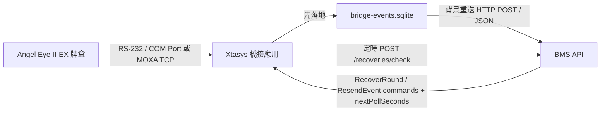

# Xtasys 橋接應用介接文件

本文件說明 `AngelEyeBmsBridge` 目前的現場部署設計。Bridge 安裝在現場電腦，透過 Windows COM Port 或 MOXA TCP 讀取 Angel Eye II-EX 牌盒事件，先寫入本機 **SQLite Outbox**，再由背景 dispatcher 以 **HTTP API POST** 推送給 BMS。

目前版本已取消 WebSocket 長連線模式；GUI 不再區分「本機監聽 / 主動連線」，只需要設定要呼叫的 BMS API 路徑與 token。

---

## 0. 目前現場規劃結論

以下為 2026-06-08 依主管回覆整理的第一版落地假設：

- 一台現場 PC 可規劃為多桌 / 多 COM Port / 多 MOXA TCP / 多 ANGEL 牌盒一組；Bridge 已支援多桌台端點，但整台 Bridge 只使用一種連線方式（COM Port 或 MOXA TCP），實體桌號 mapping 由我方部署時規劃並記錄。
- 現場 PC 目標作業系統依 2026-06-30 回覆調整為 Windows 11；COM Port 與 MOXA TCP 兩種連線方式在 Bridge 內皆可設定。
- 2026-06-30 現場補充：圖上的 `MOXA 901` 是 901 桌的 MOXA 代號，不是型號；902 / 903 類推。實際型號為 `NPort 5110`，屬於 1-port RS-232 device server，一桌對應一台 NPort。部署前仍需取得每桌 NPort 的 IP、TCP Port、operation mode（Real COM 或 TCP Server）與 serial 參數。
- 現場電腦規格、遠端工具、admin 權限、資料夾建立、Windows Service 安裝 / 更新 / 移除、outbound HTTPS、防火牆 / 白名單 / proxy 調整，均依現場申請流程辦理，可比照既有攝影棚規格規劃。
- 對方可視為非技術窗口；涉及協定細節的問題，不以口頭回覆作為最終依據，需以規格書、raw frame、遠端實機測試結果確認。
- 第一版正式模式採 read-only。Bridge 預設不對實體牌盒送 PC operation command；若有特殊現場測試需求，需啟用內部工程授權。
- 目前工程授權密碼為 `a84268426`。此密碼只用於 GUI 允許對實體牌盒送 `OP` 命令；正式上線前若資安要求更高，應改為受保護設定或部署時輪替。
- 依目前 PDF 初判，牌盒不會提供 BMS 可直接使用的桌號、靴號、局號或局唯一識別；Bridge 先自行維護靴號 / 局號，後續以遠端實機 raw frame 驗證是否有額外欄位。

### 0.1 目前已知環境資料

以下為 2026-06-29 至 2026-06-30 聊天截圖整理，仍需以現場正式規格與遠端實測確認：

| 項目 | 目前資訊 | 備註 |
| --- | --- | --- |
| TeleBet 設計文件 | TC: `https://clammy-euphonium-694.notion.site/Midori-TeleBet-V2-3-5ca368fbf5cd4fea9d8df9cb916358ba`；EN: `https://clammy-euphonium-694.notion.site/Clark-Midori-TeleBet-System-System-Design-Document-V2-3-80a4981c63c24cb8b53de8a287a748fb` | 外部參考；Bridge 仍以 ANGEL 牌盒事件 API 介接為主 |
| 測試用跳板 / 操作機 | 現場已提供 Win11 測試用跳板機，並表示目前可登入 | Bridge 可部署於此類 Win11 VM 做 NPort / MOXA 測試 |
| 伺服器規格回覆 | `16c / 64g / 200GB / RockyLinux 10` | 看起來是 TeleBet server 規格，不是 Bridge GUI 主機規格 |
| 網路位置 | 現場可提供一組 Win11 VM 在 MOXA 同網段，用於檢視環境、配置 MOXA / CCTV 或連到 server | Bridge 若部署在此 VM，理論上可連 NPort 5110 |
| 白名單用途 | 白名單用於允許外部來源連線進入現場伺服器或遠端操作來源 | 目前截圖提到來源 IP：`35.221.238.241`、`59.127.129.63` |
| 權限限制 | 現場提醒 IT 不具備動現場賭桌設備權限；網路頻寬、線路、賭桌既有設備需先由賭場技術單位 / Edgar 同意 | 不可假設可任意拆線、加線、改 MOXA 設定 |
| 現有架構限制 | 每桌牌盒已與既有賭場系統連結，不是 RGP 架構獨立桌子；拆除或加裝可能影響既有系統 | 第一版應以 read-only、低侵入測試為原則 |
| NPort 設備 | `MOXA 901` 是 901 桌 MOXA 代號，不是型號；實際設備為 `NPort 5110`，902 / 903 類推 | 需拿到每桌 NPort IP / Port / mode / serial 參數 |

下一輪現場確認最小清單：

1. 每桌 `NPort 5110` 的 IP、TCP Port、桌號對應。
2. NPort operation mode：Real COM、TCP Server 或其他模式。
3. ANGEL 牌盒 serial 參數：baud rate、data bits、parity、stop bits、flow control。
4. Win11 VM 是否可從 Bridge 程式連到每桌 NPort IP:Port。
5. 測試時可否只讀取 NPort 資料、不改動既有賭場系統線路與設定。

### 0.2 TeleBet Phase 1 MVP 邊界

依 2026-06-30 貼入的「克拉克 Midori TeleBet 系統 Phase 1 MVP」設計稿，TeleBet Phase 1 的定位是遠端客戶觀看即時影像，並由系統控管帳號、連線階段、串流存取與稽核紀錄。投注指示與現場投注執行為系統外部營運程序。

| 項目 | Phase 1 TeleBet 範圍 |
| --- | --- |
| 包含 | 玩家帳號、登入 / session、串流 token、即時影像觀看、營運後台 session 監控、手動 / 強制終止、閒置終止、VPN / 海外 / 多裝置等異常連線控管、登入 / 串流 / session / 營運介入稽核 |
| 不包含 | 投注金額輸入、客戶指示輸入、現場人員執行輸入、投注單、錢包 / 餘額、hold / release、中獎 / 落選 / 無效結算、USDT 入出金自動化、GGR / PAGCOR 正式申報、促銷 / cashback、進階風險引擎 |
| 稽核重點 | 能證明連線、觀看、session 與營運人員介入可控管 / 可稽核；投注指示與現場投注執行本身不在 Phase 1 系統紀錄範圍 |
| 主要服務 | `edge-gateway`、`bff-player`、`bff-operator`、`iam`、`account-svc`、`stream-gateway / ingest`、`audit-svc`、PostgreSQL |
| NFR 目標 | 影像延遲目標 `<= 2.5 秒`；強制終止 / 閒置終止需即時反映；稽核保存登入、session、串流與營運介入歷程 |

與 `AngelEyeBmsBridge` 的關係：

- Bridge 是 ANGEL 牌盒事件橋接工具，負責讀取 NPort / COM / MOXA TCP 上的牌盒事件，落地 SQLite Outbox，再 POST 到 BMS 事件 API。
- TeleBet Phase 1 主要處理影像觀看與 session / access / audit 控管，不依賴 Bridge 提供投注輸入、錢包或結算功能。
- 若後續 TeleBet UI 要顯示牌面或賽果，應由 BMS 後端根據 Bridge 推送的牌盒事件產生結果，再提供給前端；Bridge 不直接改前端顯示，也不處理玩家投注金額。
- 因 Phase 1 不記錄投注指示 / 現場執行，Bridge 的事件日誌只能作為牌盒事件與 BMS 推送稽核，不可替代 TeleBet 投注 SOP 的稽核紀錄。

---

## 1. 現場角色



- Bridge 是現場電腦上的常駐 GUI 應用。
- 每個桌台端點各自維護 `sourceDataCode`、選填 `sourceDataId`、`deviceId`、`shoe`、`round`。
- BMS API 是 Bridge 的事件接收端。
- Bridge 不需要 BMS 與 Bridge 建立長連線。
- 一個 Bridge 執行個體只使用一個 `bridge-events.sqlite`；同一台電腦多桌 / 多輸入端點時，以 `sourceDataCode` 作為 BMS 對應主鍵，`sourceDataId` 僅供確認與除錯，`deviceId` / `shoeId`、`connectionMode`、`comPort` 或 `moxaHost` / `moxaPort` 區分現場端點。
- 若 API 暫時失敗，事件仍保留在本機 SQLite Outbox，背景 dispatcher 會依 retry policy 自動重送。
- Bridge 會定時向 BMS 發送補償查詢，BMS 可在 response 中要求 Bridge 從本機 SQLite 補送指定事件或指定局結果。

---

## 2. GUI 設定

### 2.1 BMS 事件 API

上方 `BMS 事件 API` 區塊只保留：

| 欄位 | 說明 |
| --- | --- |
| 事件 API 路徑 | BMS 提供的 HTTP endpoint，例如 `https://bms.example.com/api/source/angel/events` |
| Token | 唯讀。Bridge 會依預先配置的訊源商 JWT 參數自動產生，並以 `Authorization: Bearer <token>` 帶出 |
| JWT設定 | 部署人員設定訊源商 ID、序號、issuer、audience、signing key 與 token 有效分鐘 |
| 複製Token | 一鍵複製目前 token，方便現場人員貼給系統管理員查核 |
| 開始傳送 / 停止傳送 | 控制 SQLite Outbox 背景 dispatcher 是否開始 POST 到 BMS；停止時新事件仍會先落地保存 |

若 API 路徑未輸入 scheme，Bridge 會自動補 `http://`。

Bridge 會由事件 API 路徑自動推導補償查詢路徑。例如事件 API 設定為：

```text
https://bms.example.com/api/source/angel/events
```

則補償查詢會送到：

```text
https://bms.example.com/api/source/angel/recoveries/check
```

Token 本身不提供手動修改。BMS 建立訊源商後，部署人員可透過 `JWT設定` 填入訊源商 ID、序號、issuer、audience、signing key 與有效分鐘；Bridge 會自動重新產生 JWT 並保存到本機 SQLite 設定表。

GCS 目前要求 token 有 `exp`，因此 Bridge 會依「有效分鐘」產生 `exp` claim。預設 issuer / audience 對應 GCS 的 SourceProvider token 設定：

```json
{
  "iss": "gs.com",
  "aud": "BMS RESTful API"
}
```

payload 會包含：

```json
{
  "http://schemas.xmlsoap.org/ws/2005/05/identity/claims/nameidentifier": "<訊源商 ID>",
  "http://schemas.microsoft.com/ws/2008/06/identity/claims/serialnumber": "<訊源商序號>",
  "iss": "gs.com",
  "aud": "BMS RESTful API",
  "exp": 1780000000
}
```

Signing key 必須與 GCS `SourceProviderTokens.IssuerSigningKey` 一致，否則 API 會回 401。此值不應交由現場廠商自行修改。開發版預設帶入 DEV / Development 的 SourceProvider signing key，方便本機測試；QA / Production 部署時必須由部署設定覆寫成對應環境值。若設定檔仍為空，GUI 會顯示 `未配置 JWT Signing Key`，且不允許開始傳送。

### 2.2 桌台 / 端點清單

每列代表一個桌台端點。`端點ID` 是 Bridge 內部端點代號，不是實體牌盒序號；現場若把 A 牌盒換成 B 牌盒，只要仍接到同一桌的 COM Port 或已重新指定 COM Port，BMS 仍以 `來源桌碼` 辨識桌台。

| 欄位 | 說明 |
| --- | --- |
| 啟用 | 是否啟用此端點 |
| 桌台 | 現場顯示用桌名 |
| 來源桌碼 | BMS SourceData 來源桌代碼，例如 `ANGEL_BAC01` |
| 端點ID | Bridge 內部端點代號，例如 `SHOE01`；不代表實體牌盒序號 |
| 靴號 | BMS 靴號，格式為 `yyyyMMddNNN`，例如 `202605270001` |
| 局號 | 此靴目前局號 |
| 連線 | 現場輸入端點，可為 Windows COM Port、MOXA TCP 或 Mock |
| 狀態 / 錯誤 / 事件 | 現場監控狀態與事件日誌入口 |

BMS 分辨同一台現場電腦上的多桌時，以事件 payload 的 `sourceDataCode` 為主要映射鍵，概念等同 T9 的 `TableId`。`sourceDataId` 只作確認與除錯，`deviceId` / `shoeId` 為 Bridge 端點識別，`shoe` + `round` 為該桌局次識別。也就是說，一台電腦可以掛多個輸入端點，但每個桌台端點必須設定不同的 BMS 來源桌碼，並對應到 BMS 內的桌台。

新安裝或沒有設定檔時，Bridge 會預設建立 PIT9 目前三張正式桌的 MOXA TCP 端點：

| 桌台 | 來源桌碼 | 來源資料ID | 端點ID | 連線 | BMS 傳送 |
| --- | --- | --- | --- | --- | --- |
| 901桌 | ANGEL_BAC901 | 空白 | SHOE901 | MOXA TCP `10.5.32.24:4001` | 關 |
| 902桌 | ANGEL_BAC902 | 空白 | SHOE902 | MOXA TCP `10.5.32.25:4001` | 關 |
| 903桌 | ANGEL_BAC903 | 空白 | SHOE903 | MOXA TCP `10.5.32.26:4001` | 關 |
| QA桌 | ANGEL_BACQA | 空白 | SHOEQA | MOXA TCP `10.5.32.124:4001` | 關 |

若偵測到舊版未配置 COM / MOXA 的預設 `ANGEL_BAC01`、`ANGEL_BAC02` 端點，Bridge 啟動時會自動升級為上述 PIT9 MOXA TCP 端點，且預設不傳送 BMS；若偵測到只有 901 / 902 / 903 的舊 PIT9 預設，也會自動補上 QA 桌。已手動配置過實體連線的端點不會被覆蓋。

預設靴號依當天日期產生，格式為 `yyyyMMdd001`；預設局號從 `1` 開始。

### 2.3 選取桌台細節

- `即時牌面`：顯示目前牌面、連線 / BMS 狀態、換靴確認、PC 對牌盒請求與 Mock 測試操作。原本的「維護測試」內容已併入此分頁，不再另外顯示維護測試分頁。
- `連線方式`：位於上方全域設定區，按 `連線方式` 會開啟設定視窗，整台 Bridge 只能選一種模式：`COM Port` 或 `MOXA TCP`。切換前需先斷開實體牌盒連線。
- `連線設定`：保留桌台名稱、端點ID、BMS靴號、局號、連線資料、啟用、下注秒數與套用。每張桌只各自填自己的 COM Port，或 MOXA IP / TCP Port。欄位預設唯讀，需按 `編輯設定` 才可修改，避免現場誤觸。
- `BMS 對應`：設定來源桌碼、來源資料 ID 與是否自動傳送 BMS。新建端點預設不傳送，欄位同樣預設唯讀，需按 `編輯設定` 才可修改。
- `下注秒數` 是每個桌台端點自己的設定；新局開始時送給 BMS 的 `totalBetTime`，語意參考 T9 `StartGame.TotalBetTime`，預設 20 秒，可依現場桌台設定調整。
- 第一版正式模式預設 read-only，不會對實體牌盒送 `OP` 命令。GUI 的 `PC 對牌盒請求` 區只保留工程授權後的非日常硬體請求，包含 `OP LK` 鎖定 / 解鎖、`OP EC` 清錯，以及人工實機確認用的 `OP GP 00` 流程確認；未啟用工程授權時，這些按鈕不可送出命令。啟用工程授權需輸入密碼 `a84268426`。Mock 模式不受此限制，因為不會寫實體連線。
- `Mock 模擬測試`：平常只顯示 Mock 開關；開啟 Mock 後才顯示 `模擬發牌`、`模擬結算`、`模擬切牌`、`自動跑局`、`重置測試`，並可設定自動跑局 N 局後模擬切牌。若實體連線已連線，Mock 模式不可開啟；需先斷線再切換 Mock。

連線方式是全域設定，透過上方 `連線方式` 按鈕開啟視窗調整。此設定套用到所有桌台，不允許同一台 Bridge 中一桌使用 COM Port、另一桌使用 MOXA TCP。

| 連線方式 | 說明 |
| --- | --- |
| COM Port | 適用於牌盒直接接 Windows COM，或 MOXA / NPort driver 已映射成 Windows COM Port 的情境。Bridge 只會從本機偵測到的 COM 清單選擇，不允許手輸。 |
| MOXA TCP | 適用於 MOXA 以 TCP Server 提供序列資料、且現場不映射 Windows COM 的情境。需填廠商提供的 MOXA IP / Host 與 TCP Port，例如 `10.5.32.25:4001`。 |

現場 NPort 5110 對應方式：

| NPort 5110 設定 | Bridge 設定 |
| --- | --- |
| NPort / Real COM driver 已在 Win11 VM 映射成 Windows COM Port | 選 `COM Port`，每桌選對應 COM |
| NPort 5110 設為 TCP Server，由 Bridge 直接連 IP:Port | 選 `MOXA TCP`，每桌填對應 NPort IP / TCP Port |

---

## 3. API 推送

### 3.1 HTTP request

Bridge 對設定的 `事件 API 路徑` 發送：

```http
POST /api/source/angel/events HTTP/1.1
Content-Type: application/json
Authorization: Bearer <token>
```

Bridge 會在開始傳送前自動產生 Bearer token；若 token 無法產生，Bridge 不會開始傳送。

### 3.2 補償查詢 / 補送輪詢

Bridge 啟動 BMS 傳送後，會定時向 BMS 發送補償查詢。預設下一次查詢為 15 秒；BMS 可用 `nextPollSeconds` 調整輪詢間隔，Bridge 會限制在 10 秒到 5 分鐘之間。若 BMS 暫時無回應，Bridge 會退避為 30 / 60 / 120 / 300 秒，避免持續打爆 BMS。

```http
POST /api/source/angel/recoveries/check HTTP/1.1
Content-Type: application/json
Authorization: Bearer <token>
```

補償查詢會帶每個桌台端點目前狀態，包含 `sourceDataCode`、`sourceDataId`、`deviceId`、連線方式 / 連線端點、靴號、局號、Outbox 待送數與最後事件。

BMS response 可回傳 `commands`：

```json
{
  "errCode": 0,
  "errMsg": "",
    "data": {
      "accepted": true,
      "serverTime": "2026-05-29T03:30:00Z",
      "nextPollSeconds": 15,
      "rateLimited": false,
      "commands": [
        {
          "commandId": "cmd-001",
        "type": "RecoverRound",
        "sourceDataCode": "ANGEL_BAC01",
        "deviceId": "SHOE01",
        "shoe": 202605290001,
        "round": 12
      }
    ]
  }
}
```

目前 Bridge 支援：

| Command | 行為 |
| --- | --- |
| `RecoverRound` | 依 `sourceDataCode` / `deviceId` / `shoe` / `round` 查本機 SQLite 的 `GameResult`，找到後以原本 `eventId` 重新排入 Outbox 補送 |
| `ResendEvent` | 若帶 `eventId`，重送該事件；否則依 `eventType`、桌碼、牌盒、靴局條件查詢後重送 |

目前 GCS 端的主流程是由 Bridge 呼叫 `/recoveries/check`，再由 GCS 服務查詢 `BetRecordLIVEUnsettled` 與 `GameResultBAC` 判斷是否有缺少最終賽果的局。若某桌某靴局已到重試時間、仍處於未完成狀態且尚無 `GameResultBAC`，BMS 會回傳 `RecoverRound`，Bridge 下一次查詢取得命令後，會從本機 SQLite requeue 原事件，最後仍走原本 `/events` Outbox 流程補送。

GCS 會以 Redis TTL 對同一個 `bridgeId` 做短時間節流；若查詢太頻繁，response 會帶 `rateLimited: true` 與較長的 `nextPollSeconds`。舊的 heartbeat / Redis pending command queue 可保留作為相容或人工命令通道，但未完成局補償以 `/recoveries/check` 為主。

若找不到指定資料，Bridge 會在本機事件日誌記錄 not-found；此時 BMS 端需要走人工排查或後續補償流程。

### 3.3 成功與失敗

- HTTP `2xx` 且 ACK 未拒收時視為推送成功，Outbox 事件會標記為 `Sent`。
- 非 `2xx`、timeout 或 ACK rejected 會記錄在 GUI 事件日誌，並將事件標記為 `Failed`。
- `Failed` 事件不會刪除；背景 dispatcher 會依遞增延遲自動重送。
- 重送時使用同一個 `eventId` 與同一份 payload，不會產生新事件。
- Bridge GUI 事件日誌與 GCS 接收端 log 都會加上固定前綴 `【ANGEL】`，排查時可直接用此關鍵字過濾，例如 `docker logs gamecontrolservice --tail 200 | Select-String "【ANGEL】"`。

---

## 4. 事件 JSON

所有事件共用外層欄位：

```json
{
  "type": "CardDrawn",
  "source": "AngelEyeIIEx",
  "sequence": 123,
  "eventId": 123,
  "timestamp": "2026-05-27T08:10:23.456Z",
  "deskName": "百家樂一號",
  "sourceDataId": "A8B0E2E1-65F4-4D5D-84C7-6CE30B115101",
  "sourceDataCode": "ANGEL_BAC01",
  "shoeId": "SHOE01",
  "deviceId": "SHOE01",
  "shoe": 202605270001,
  "round": 12,
  "roundId": 12,
  "shoeRound": "20260527000112",
  "state": "Dealing",
  "connectionMode": "ComPort",
  "comPort": "COM3",
  "data": {}
}
```

| 欄位 | 說明 |
| --- | --- |
| `type` | 事件類型 |
| `source` | 固定來源識別 |
| `sequence` | Bridge 執行期間遞增序號 |
| `eventId` | 寫入 SQLite journal 後產生的本機事件 ID |
| `timestamp` | UTC ISO-8601 |
| `deskName` | 現場顯示用桌名 |
| `sourceDataCode` | 必填。BMS `SourceDataSet.Code`，例如 `ANGEL_BAC01`；概念等同 T9 `TableId` |
| `sourceDataId` | 選填。BMS `SourceDataSet.Id` GUID，僅供確認與除錯 |
| `shoeId` / `deviceId` | Bridge 端點識別，不代表實體牌盒序號 |
| `shoe` | BMS 靴號 |
| `round` / `roundId` | 局號 |
| `shoeRound` | 靴號與局號串接字串 |
| `totalBetTime` | `StartGame` 事件使用，代表下注倒數秒數 |
| `connectionMode` | Bridge 全域連線方式，`ComPort` 或 `MoxaTcp`；所有桌台一致 |
| `comPort` | Windows COM Port；COM 模式時使用 |
| `moxaHost` / `moxaPort` | MOXA TCP 連線資訊；MOXA TCP 模式時使用 |
| `state` | Bridge 對事件狀態的分類 |
| `data` | 事件細節 |

### 4.1 `StartGame`

Bridge 在偵測到新局第一張牌前，會先送出 `StartGame`，讓 BMS 進入倒數狀態。此事件只更新即時桌況，不寫入賽果 DB。

收到上一局 `GameResult` 後，Bridge 會保留 GUI 結果畫面 3 秒，再自動進入下一局下注倒數並送下一局 `StartGame`。正式 read-only 模式下，Bridge 不會對實體牌盒送 `Lock ON / Lock OFF`；若工程授權已啟用，才會在結果保留期間嘗試以 `OP LK` 鎖定並於下一局倒數前解除。`R` retransmission 不代表新局開始，不會觸發倒數或 `StartGame`。這個 3 秒保留是 Bridge / BMS 流程設計，不是 Angel Eye II-EX 硬體保證會在結算後自行送下一局訊號。

收到 `CutCardDrawn` 後，Bridge 不會自動下一局，會標記此靴已到鞋尾並停止自動跑局。正式 read-only 模式下，Bridge 只靠流程狀態忽略未按 `新靴` 前收到的後續實體牌面；若工程授權已啟用，才會嘗試對實體牌盒送出 `Lock ON`。現場停靴 / 換靴完成後，操作員按 GUI `新靴`；Bridge 會切到下一個靴號、清除鞋尾狀態，並立即進入新靴第 1 局下注倒數，送出新靴第 1 局 `StartGame`。

```json
{
  "type": "StartGame",
  "state": "Countdown",
  "totalBetTime": 20,
  "startTime": "2026-05-28T04:10:23.456Z",
  "data": {
    "totalBetTime": 20,
    "startTime": "2026-05-28T04:10:23.456Z",
    "bootId": "202605280001",
    "groupId": 1
  }
}
```

### 4.2 `CardDrawn`

```json
{
  "type": "CardDrawn",
  "state": "Dealing",
  "data": {
    "target": "Player",
    "index": 1,
    "suit": "Heart",
    "value": "A"
  }
}
```

`target` 為 `Player` 或 `Banker`。`index` 為該方第幾張牌。此事件語意接近 T9 `KeyPress`，只更新即時牌面，不寫入賽果 DB。若此牌盒已收到 `CutCardDrawn` 但尚未按 GUI `新靴`，Bridge 會忽略後續實體 `D` 牌面，不送 `StartGame` 或 `CardDrawn` 到 BMS。

### 4.3 `GameResult`

`GameResult` 語意接近 T9 `Settle`。BMS 端應只在此事件寫入 `GameResultBAC`。Bridge 收到 `GameResult` 後會排程 3 秒後進入下一局倒數，GUI 結果橫幅會顯示這 3 秒保留倒數條。正式 read-only 模式下不會送實體牌盒命令；只有工程授權啟用時，Bridge 才會在結果保留期間對實體牌盒送 `Lock ON`，並在準備進下一局倒數前送 `Lock OFF`。Mock 不送實體命令，只套用相同 GUI / BMS 流程。斷線、新靴、Mock 重置、錯誤、切牌、收到下一局第一張牌、移除牌盒或關閉程式都會取消尚未執行的下一局倒數排程。

```json
{
  "type": "GameResult",
  "state": "Settled",
  "data": {
    "result": "BankerWin",
    "pair": "BankerPair"
  }
}
```

`result` 可能值：

| 值 | 說明 |
| --- | --- |
| `PlayerWin` | 閒贏 |
| `BankerWin` | 莊贏 |
| `Tie` | 和局 |
| `ForceQuit` | 強制終止 |

`pair` 可能值：

| 值 | 說明 |
| --- | --- |
| `None` | 無對 |
| `PlayerPair` | 閒對 |
| `BankerPair` | 莊對 |
| `BothPair` | 閒莊皆對 |

### 4.3 `CutCardDrawn`

```json
{
  "type": "CutCardDrawn",
  "state": "ShoeEnding",
  "data": {
    "shoeEnding": true,
    "rawBytes": "05 31 43 ..."
  }
}
```

Bridge 收到切牌事件後會標記此靴即將結束。正式 read-only 模式下不會對實體牌盒送命令；只有工程授權啟用時，才會嘗試送出 `Lock ON`。現場流程上應停靴 / 換靴；使用 GUI `新靴` 後，Bridge 會讓靴號加 1，並立即進入新靴第 1 局下注倒數。跨日換靴時會依日期從 `yyyyMMdd001` 開始。未按 `新靴` 前收到的實體牌面仍會被忽略，避免送出錯靴號 / 錯局號資料。

### 4.4 `Error`

```json
{
  "type": "Error",
  "state": "Error",
  "data": {
    "errorCode": 2,
    "errorMessage": "發牌過多 (Overdraw)",
    "inErrorMode": true
  }
}
```

### 4.5 `LockStatus`

```json
{
  "type": "LockStatus",
  "state": "Locked",
  "data": {
    "isLocked": true
  }
}
```

### 4.6 `ErrorCleared`

```json
{
  "type": "ErrorCleared",
  "state": "Normal",
  "data": {
    "errorCode": 2,
    "errorMessage": "發牌過多 (Overdraw)"
  }
}
```

---

## 5. 回查與保存

Bridge 目前不提供 HTTP 查詢服務。事件與 Outbox 狀態會寫入執行目錄：

```text
bridge-events.sqlite
```

BMS 若需要線上回查某局賽果，建議在接收 API 時自行落庫，查詢以 BMS DB 為準。

若現場需要從 Bridge 本機補查，可用 SQLite 依 `sourceDataCode`、`deviceId`、`shoe`、`round`、`type` 查詢原始 payload，並可用 `status`、`retry_count`、`last_error` 檢查是否已送達。SQLite 為了相容舊版 schema，仍以 `desk_id` 欄位保存來源桌碼。

---

## 6. Mock 模式

Mock 模式只供 GUI 與 BMS API 串接流程測試，不代表實體牌盒會自行計算補牌或賽果。

Mock 行為：

- `模擬發牌`：依百家樂發牌流程注入下一張 `CardDrawn`；單局最多閒 / 莊各 3 張。若本局不應再抽牌而仍按下，會模擬 `Error / Overdraw`。
- `模擬結算`：依目前 GUI 牌面計算閒 / 莊點數、輸贏與對子；同一局只會送出一次 `GameResult`，並與實體 `GameResult` 一樣保留結果 3 秒後才進入下一局倒數。
- `模擬切牌`：模擬現場抽到切牌，Bridge 會送出 `CutCardDrawn`、標記 `ShoeEnding`、停止自動跑局並取消下一局倒數；後續需由操作員按 `新靴` 模擬現場停靴 / 換靴確認，按下後會直接進入新靴第 1 局倒數。
- `自動跑局`：自動發閒 1、莊 1、閒 2、莊 2，再依標準百家樂規則補第三張並結算；結算後同樣保留結果 3 秒，再進入下一局倒數。若開啟 N 局後切牌設定，會在完成第 N 局結算且保留結果 3 秒後注入 `C`，停止自動跑局並走 `CutCardDrawn` / `ShoeEnding` 流程。
- `重置測試`：停止自動跑局，清空本機 Mock 牌面、結算橫幅與模擬錯誤狀態；不變更靴號。下一次 `模擬發牌` 會從新一局第一張開始。

結果保留期間與下注倒數期間，`模擬發牌` 不可用，避免測試操作在尚未進入下一局前清掉結果。

正式實體連線時，Bridge 不自行判斷輸贏或補牌；它只轉發 Angel Eye 牌盒送出的事件。

---

## 7. 硬體警告

直通線連接時，牌盒端 DB9 公頭第 8、9 腳必須 NC 斷開，避免毀損牌盒主板或電腦串口。
